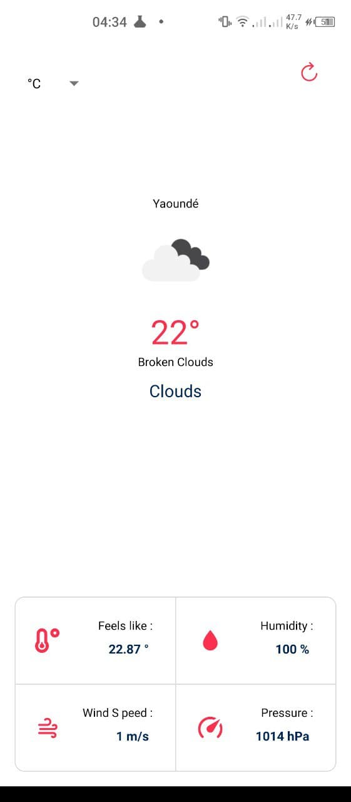

# Build a weather App using Expo-React-Native

1 - clone the repository

2 - Install the dependecies `npm install` in the repository 

3 - Goto openweather map and create an account, get your api keys [By Geographic Coordniates] `https://openweathermap.org`

4 - create your .env file and add these two 

`WEATHER_API_KEY=[your api key]` and 
`BASE_WEATHER_URL=https://api.openweathermap.org/data/2.5/weather?`

5 - yarn start or npm start or expo start

